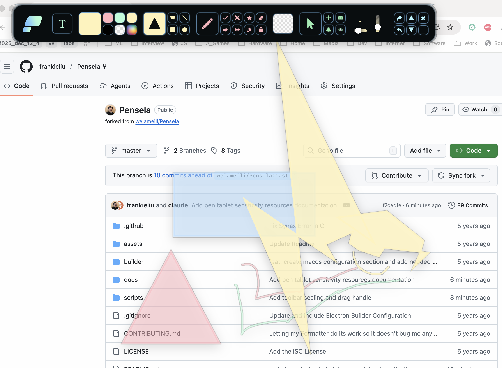

<p align="center">

</p>

---

# Pensela: The Swiss Army Knife of Screen Annotation Tools

***Note: This Project is no longer being mantained. If you want to take the role of a mantainer open an issue requesting the same and I'll assign it to you.***

## Features

-   Basic Shapes
    -   Rectangle
    -   Circle
    -   Triangle
    -   Lines (Straight and Freehand)
    -   Any Polygon
-   Stickers: Pre Added Shapes
    -   Star
    -   Cross
    -   Tick
    -   Single and Double Sided Arrows
-   Highlighter
-   Laser Pointer
-   Screenshot Tool
-   Text Support
-   Backgound Pages
-   Custom Color Picker &nbsp;
-   And More ...

## Screenshots




A Promo / Demo can be found [here](https://youtu.be/OzpgCw24ut8)

## Fork Enhancements

This fork includes several improvements and new features:

### Brush Controls
- **Visual Brush Preview** - Real-time circular preview showing current brush size
- **Brush Size Slider** - Drag slider to adjust brush size (2-10px range)
- **Global Opacity Slider** - Adjust transparency for all drawing tools (0-100%)
- **Default Settings** - Starts with freehand tool, 5px brush, 50% opacity

### Toolbar Improvements
- **Scalable Toolbar** - Use up/down buttons to resize toolbar (0.5x to 1.5x)
- **Draggable Handle** - Drag the top strip to reposition the toolbar
- **Compact Default Size** - Toolbar starts at 80% scale for less screen clutter

### Technical Improvements
- **Electron 40.4.1** - Upgraded from Electron 11 for better compatibility
- **electron-builder 26.7.0** - Modern build system with Python 3 support
- **macOS Build Script** - `npm run build:mac` builds and signs automatically
- **Fixed Extra Click Bug** - Tools now respond on first click (acceptFirstMouse)

### Documentation
See the `docs/` folder for detailed documentation:
- [macOS Build Guide](docs/macos-build-guide.md)
- [Brush Preview Feature](docs/brush-preview-feature.md)
- [Opacity Slider Feature](docs/opacity-slider-feature.md)
- [Toolbar Scaling Feature](docs/toolbar-scaling-feature.md)
- [Default Settings Feature](docs/default-settings-feature.md)
- [Extra Click Bug Fix](docs/extra-click-bug-fix.md)

## Installation

**Packages can be Found in the [releases](https://github.com/weiameili/Pensela/releases) Section**

**Note**: Imagemagick is required for screenshots on linux and screenshots are not guaranteed to work on wayland as of now.

| OS                 | Instructions                                                                                                                                                          |
| ------------------ | --------------------------------------------------------------------------------------------------------------------------------------------------------------------- |
| Debian Based Linux | A .deb archive has been provided                                                                                                                                      |
| Arch Linux         | Arch user can install the [pensela-bin](https://aur.archlinux.org/packages/pensela-bin/) aur package or the prebuilt package archive provided in the releases section |
| Other Linux        | An AppImage has been provided                                                                                                                                         |
| Windows            | Download and run the setup provided in the releases section. You will have to disable your antivirus and / or mark the setup as safe                                  |
| Mac OS             | A dmg has been provided. Or use Homebrew: `brew install --cask pensela`                                                                                               |

## Features to be Added in Future Versions

-   Better UX
-   Auto Updates
-   Guided "Getting Started" Tour
-   Add more Features
    -   Full-fledged Screen Recording Tool
    -   Better Text Support
    -   Seperate Colors For Stroke and Fill
    -   Better Laser Pointer

## Development

### Quick Start

```bash
# Install dependencies
npm install

# Run in development mode
npm start

# Build for current platform
npm run build

# Build for macOS (includes code signing)
npm run build:mac

# Open the app
open build/mac-arm64/Pensela.app
```

### Build Outputs

- `build/mac-arm64/Pensela.app` - Application bundle
- `build/Pensela-1.2.5-arm64.dmg` - DMG installer

See [docs/macos-build-guide.md](docs/macos-build-guide.md) for detailed build instructions and troubleshooting.

## Contributing

Any kind of contribution is welcome

1. Fork the Project
2. Install the dependencies with npm
3. Create your Feature Branch
4. Commit your Changes
5. Push to the Branch
6. Open a Pull Request

Feel free to report an issue or request a feature in the Issues Section.

### Conributors

<a href="https://github.com/weiameili/pensela/graphs/contributors">
  
</a>

## License

Distributed under the ISC License.
